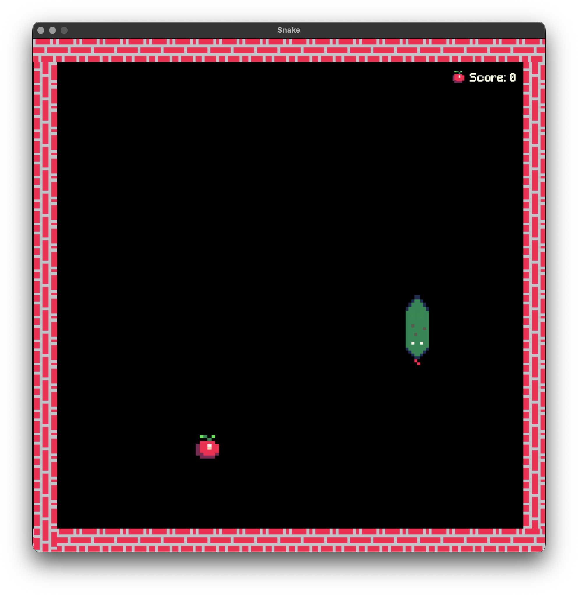

# GAMEJAM Spring 2026

 

## Game
Classic game of snake. It has two types of fruits, a normal red apple, worth 1 point, and a golden apple, worth 3 points.

### Dependecies
`pygame`

### Commands:
`python main.py`

 

### Controls:
`W` or `↑` – Move upwards  
`A` or `←` – Move to the left  
`S` or `↓` – Move downwards  
`D` or `→` – Move to the right 

## Other info
We were a group of 4, but half of them didn't respond, so we, the last two decided, to work on our own, so I did this by myself.
I know it's a simple game and that I followed a lot the tutorial, so I don't expect much, most of the credit really is to the tutorial.
Some ideas for improvement I have are:
1. Multiplayer  
2. Different modes (e.g. easy = snakes moves slower, hard = snake moves faster) 
3. Better UI (Be able to change the screen size, a settings menu, etc.)  
4. More fruits (e.g. a 2x speed fruit)

## Credits
### Code:
PyGame Tutorial by Clear Code "The ultimate introduction to Pygame": https://www.youtube.com/watch?v=AY9MnQ4x3zk  
Snake Tutorial by Clear Code "Learning pygame by creating Snake [python tutorial]": https://www.youtube.com/watch?v=QFvqStqPCRU  
### Sprites:
Snake sprites by Cosme "Snake Game Assets": https://cosme.itch.io/snake

### Sounds
Eating sound by Clear Code "crunch.wav": https://github.com/clear-code-projects/Snake/blob/main/Sound/crunch.wav  
Background Music by Clement Panchout – www.clementpanchout.com "Clement Panchout _ LJ_Tel_HipHop.wav": https://clement-panchout.itch.io/yet-another-free-music-pack 